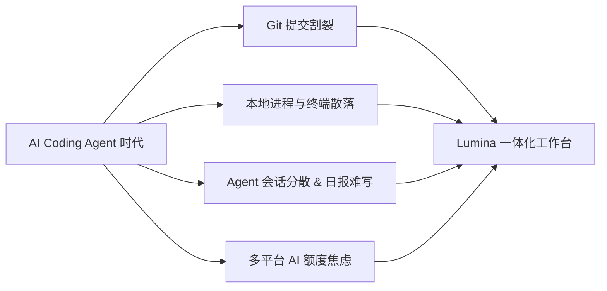
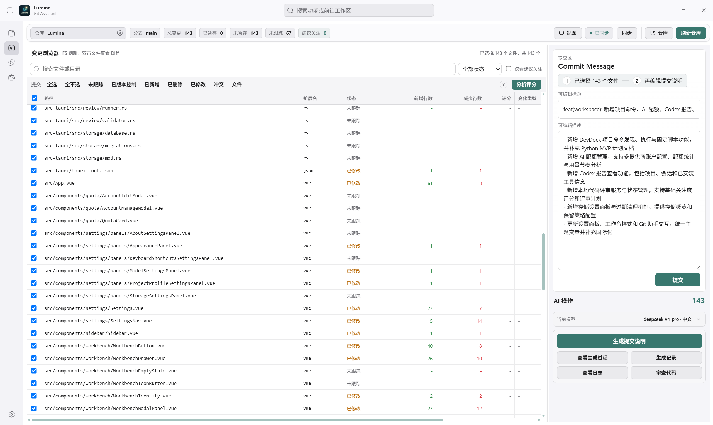
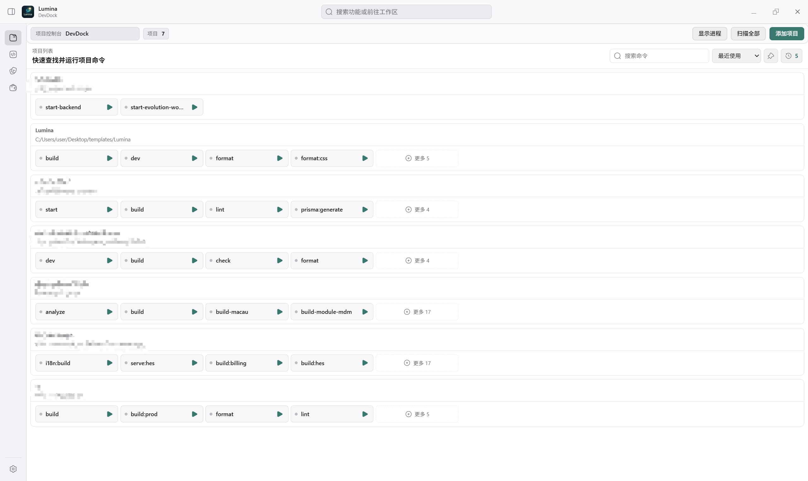
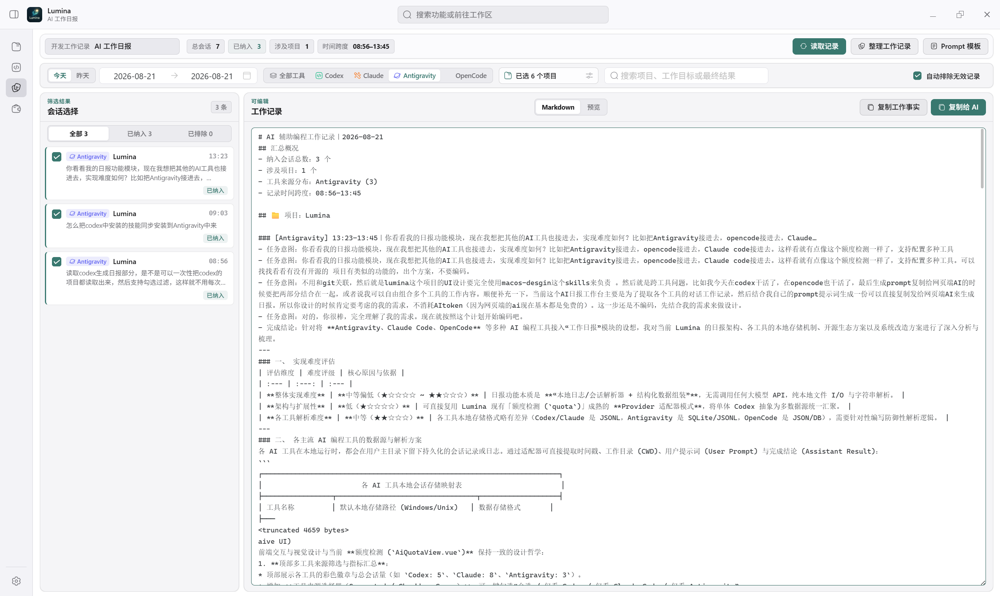
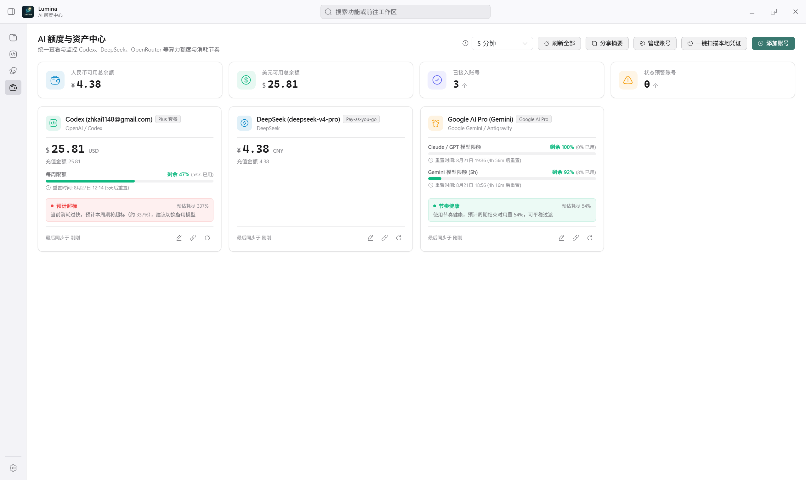
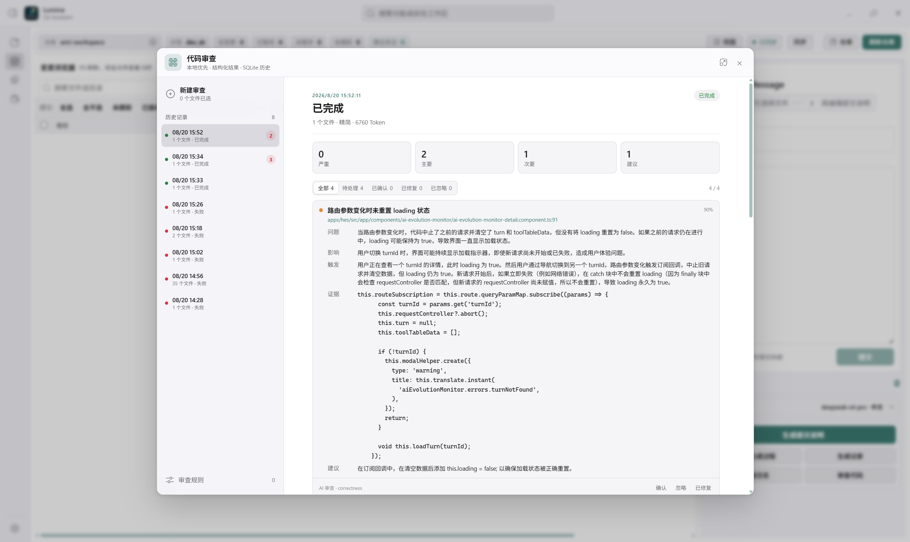

# Lumina

<p align="center">
  
</p>

<p align="center">
  <strong>专为 AI Coding 时代多项目开发者打造的本地桌面工作台</strong>
</p>

<p align="center">
  <a href="#english">English</a> ·
  <a href="https://github.com/zhkai-ybwn/Lumina/releases">下载发布版本</a> ·
  <a href="https://github.com/zhkai-ybwn/Lumina/issues/new/choose">反馈与建议</a>
</p>

<p align="center">
  
  
  
  
  
  
</p>

---

## 📖 为什么做 Lumina？

随着 **Claude Code、Google Antigravity、Codex CLI、OpenCode、Cursor** 等 AI Coding Agent 成为现代开发者的主力工具，我们的编码方式发生了剧变：大量业务逻辑在 Agent 对话中被极速实现，但原有的本地开发工具链并没有跟上节奏，反而产生了大量碎片化痛点：



1. **Git 提交的繁琐与割裂**：
   - 过去为了生成标准的 Conventional Commit，要把 Diff 贴给昂贵的通用大模型，成本高昂。
   - 如果用外置脚本生成了提交信息，又不得不频繁切回终端或各种 Git GUI 工具去执行 Commit，工作流严重割裂。
   - **Lumina 的解法**：打造完整的内置 Git 工作台。支持基于 Diff 快速生成结构化 Commit Message，配合创新的**“选择性提交原子保护”**（只提交勾选文件，自动安全隔离并恢复未勾选文件的暂存区），在单一界面完成从 AI 生成到提交推送的全闭环。

2. **多项目进程与僵尸进程痛点（DevDock）**：
   - 在 Agent 辅助下我们往往同时开发、维护多个前后端项目。服务随手在 CMD、PowerShell 或编辑器终端里启动，窗口散落一地，端口经常冲突被占，后台僵尸进程甚至持续吞噬几 GB 的内存。
   - **Lumina 的解法**：**DevDock 多项目进程看板**。统一探测项目脚本（npm/yarn/pnpm/bun/Python/Shell），提供**进程树级强力终止（Tree Kill）**、监听端口与 URL 实时嗅探、以及内置高亮日志视窗。

3. **跨 Agent 会话聚合与 0 消耗日报（AI Session Hub）**：
   - 现今的 AI 开发工作台已不仅是单一工具，开发者会混用 **Claude Code、Codex CLI、Google Antigravity、OpenCode** 等多个 Agent。各个工具在本地磁盘留下了大量多线程会话记录，下班前汇总日报时难以梳理。
   - 如果直接让 Agent 总结，不仅受限于单会话的上下文窗口，而且 **Agent 宝贵的高级模型 Token 额度不该浪费在写日报这种重复事务上**。
   - **Lumina 的解法**：**纯本地磁盘 IO 极速解析（0 Token 消耗）**。自动扫描本地所有受支持的 AI 工具会话与 Git 提交，一键聚合工作流，搭配内置模板**一键复制到网页端免费大模型（ChatGPT/Claude/Kimi）**秒级生成精美日报。

4. **多平台 AI 额度把控不足（AI Quota）**：
   - 开发者手头同时有 DeepSeek、Gemini、OpenRouter 等多种 API Key，查余额要分别登录多个官网后台，极其繁琐，且对 5 小时/每日调用限额缺乏预警。
   - **Lumina 的解法**：集成配额大盘，支持本地服务与云端接口余额轮询，并通过独创的 **Pace 节奏算法** 实时计算当前消耗速率（On Pace / Over Pace）。

---

## 🌟 核心功能模块

### 1. 🔀 Git Assistant —— 深度集成的 AI 提交工作台

- **低成本 Conventional Commit 生成**：按选中文件构建 Prompt，支持 DeepSeek、Ollama 及 OpenAI 兼容模型，单次生成成本不到 1 分钱。
- **暂存区原子隔离保护**：即使工作区有多个已暂存文件，也能单独勾选部分文件提交，提交成功后**自动恢复未勾选文件的暂存状态**，杜绝误提交。
- **完整 Git 生命周期**：文件树对比、Head Diff、分支切换/合并/删除、上游关联、Git Log 历史追溯、Merge/Rebase 冲突标记。

<!-- 截图占位：Git Assistant 主界面与 AI 提交生成 -->


> **实测数据**：近 30 天 41 次提交生成仅消耗 ¥0.36：
> 
> 

---

### 2. 🚢 DevDock —— 多项目本地进程统一管控中心

- **全脚本自动发现**：深度解析项目 `package.json` scripts 以及 Python、PowerShell、Cmd 脚本。
- **进程树级终止（Tree Kill）**：彻底清除由子进程衍生的僵尸后台进程，释放占用内存。
- **端口与 Localhost URL 智能嗅探**：从控制台实时日志中识别服务监听端口与访问链接，支持一键浏览器安全直达。
- **内置统一日志面板**：告别凌乱终端黑框，提供 ANSI 高亮着色、日志等级过滤与关键字搜索。

<!-- 截图占位：DevDock 多项目进程看板与日志弹窗 -->


---

### 3. 📝 AI 工作记录与 0 消耗日报工作台

支持跨多款主流 AI Coding 工具的多源数据提取与会话聚合：
- 🟢 **Claude Code**：自动解析 `~/.claude/projects/` 会话记录。
- 🔵 **Codex CLI**：自动解析 `~/.codex/sessions/` 本地 JSONL 记录。
- 🟣 **Google Antigravity**：自动读取 `~/.gemini/antigravity/brain/` 轨迹与工程映射。
- 🟠 **OpenCode**：自动读取本地 Storage 会话。

**核心体验**：
- **0 Token 消耗**：基于本地磁盘 IO 极速读取与语义清洗，不消耗任何 API 额度。
- **多维度筛选**：按时间范围（今天/昨天/自定义）、工具来源（Claude/Codex/Antigravity/OpenCode）、项目名与关键字自由组合过滤。
- **一键复制到 Web AI**：内置 Morning Standup、技术总结等 Prompt 模板，一键复制格式化内容至任意 Web 端大模型生成日报。

<!-- 截图占位：AI 工作记录与日报生成界面 -->


---

### 4. 📊 AI Quota —— 聚合配额与消耗节奏监控看板

- **多平台账户聚合**：实时汇总 DeepSeek、Gemini (Google AI Pro 语言服务 / AI Studio)、OpenRouter 等平台的额度与健康状态。
- **Pace 速率评估算法**：根据 5 小时 / 每日限额重置窗口，动态计算当前是用量安全（On Pace）还是超速消耗（Over Pace），告别限流焦虑。

<!-- 截图占位：AI Quota 多平台配额监控看板 -->


---

### 5. 🛡️ Local Code Review —— 本地代码审查引擎

- **规则 + AI 双引擎审查**：结合本地确定性规则库与大模型深度语义诊断，提供 Strict / Balanced / Fast 预算模式。
- **缺陷分级归类**：按 `Critical`（严重）、`Major`（重要）、`Minor`（次要）、`Suggestion`（建议）精确定位至源码行。
- **本地 SQLite 持久化**：审查记录完全离线保存在本地数据库中，随时追溯复盘。

<!-- 截图占位：Local Code Review 本地代码审查界面 -->


---

## 📥 安装与运行

### 方式一：下载桌面安装包

前往 [GitHub Releases](https://github.com/zhkai-ybwn/Lumina/releases) 下载最新发布包：
- **Windows**: `.exe` (NSIS 安装包) / `.msi`
- **macOS**: `.dmg` (支持 Intel & Apple Silicon)
- **Linux**: `.deb` / `.AppImage`

### 方式二：从源码编译运行

**环境要求**：
- [Node.js](https://nodejs.org/) (>= 20.0.0)
- [Rust & Cargo](https://www.rust-lang.org/) (>= 1.77.2)
- Git
- [Tauri 2 环境依赖](https://v2.tauri.app/start/prerequisites/)

```bash
# 1. 克隆项目
git clone https://github.com/zhkai-ybwn/Lumina.git
cd Lumina

# 2. 安装前端依赖
npm install

# 3. 启动本地开发调试
npm run tauri:dev

# 4. 构建生产发布安装包
npm run tauri:build
```

构建产物将输出至 `src-tauri/target/release/bundle/`。

---

## 🔒 隐私与本地优先（Local-First）原则

- 🛡️ **数据零泄漏**：所有配置、Git 历史、审查记录与会话解析均在本地完成，无任何隐式云端上报。
- 🔑 **API Key 自治**：API 凭据保存在本地，仅在用户显式触发时直连对应模型服务商，绝不经过任何第三方服务器中转。
- ⚙️ **显式执行机制**：DevDock 严格限制在用户主动添加的可信项目目录内执行脚本，安全可控。

---

## 🤝 反馈与共建

Lumina 诞生于一线开发者的真实痛点，期待您的体验与反馈：
- 🐛 **提交 Bug / 报错**：[创建 Issue](https://github.com/zhkai-ybwn/Lumina/issues/new/choose)
- 💡 **提出新需求 / 想法**：[提交 Feature 建议](https://github.com/zhkai-ybwn/Lumina/issues/new/choose)
- 💻 **参与代码贡献**：欢迎阅读 [CONTRIBUTING.md](CONTRIBUTING.md) 提交 PR。

---

## 📄 开源协议

本项目采用 [MIT License](LICENSE) 开源。

---

<a id="english"></a>

# Lumina (English)

<p align="center">
  <strong>A modern, local-first developer workbench built for the AI Coding Agent era.</strong>
</p>

<p align="center">
  <a href="#lumina">中文说明</a> ·
  <a href="https://github.com/zhkai-ybwn/Lumina/releases">Download Releases</a> ·
  <a href="https://github.com/zhkai-ybwn/Lumina/issues/new/choose">Report Issues</a>
</p>

---

## 💡 Why Lumina?

As **AI Coding Agents** (Claude Code, Google Antigravity, Codex CLI, OpenCode, Cursor, etc.) take over modern software development, developer workflows have fundamentally shifted. Lumina was crafted to bridge the critical gaps in this new landscape:

1. **Integrated Git Workbench & Low-Cost AI Commits**: Generates structured Conventional Commits with low-cost models without wasting expensive agent tokens, and eliminates screen-switching friction by executing commits and branch management directly in place. Features **atomic index protection** to commit selected files while preserving unselected staged changes.
2. **DevDock Multi-Project Hub**: Centralizes script execution across multiple projects, prevents runaway zombie processes with tree-level termination, and sniffs listening ports / localhost URLs automatically.
3. **Multi-Agent Session Hub & Zero-Token Standups**: Aggregates sessions from **Claude Code**, **Codex CLI**, **Google Antigravity**, and **OpenCode** using pure local disk IO (**0 Token Cost**), combining them with customizable templates for 1-click pasting into free web AI models.
4. **Unified AI Quota Dashboard**: Aggregates balances across DeepSeek, Gemini, and OpenRouter with intelligent **Pace rate-limit evaluation**.
5. **Local Code Review**: Combines deterministic rules and AI semantic diagnosis offline in local SQLite.

---

## 📥 Quick Start

Download pre-built installers from [GitHub Releases](https://github.com/zhkai-ybwn/Lumina/releases), or build from source:

```bash
git clone https://github.com/zhkai-ybwn/Lumina.git
cd Lumina
npm install
npm run tauri:dev
```

Build production installer: `npm run tauri:build`.

---

## 📄 License

Distributed under the [MIT License](LICENSE).


