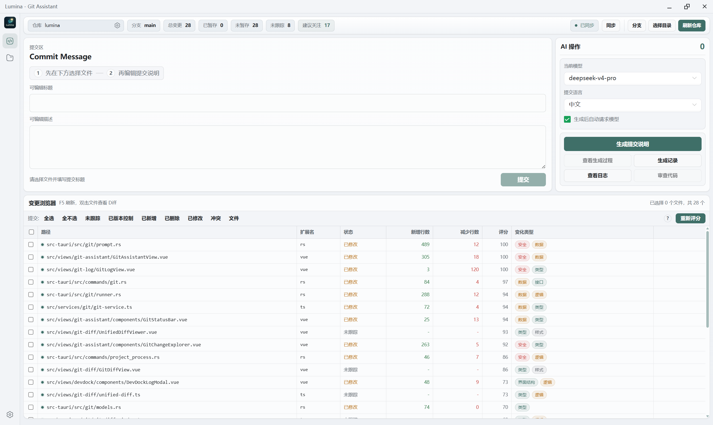
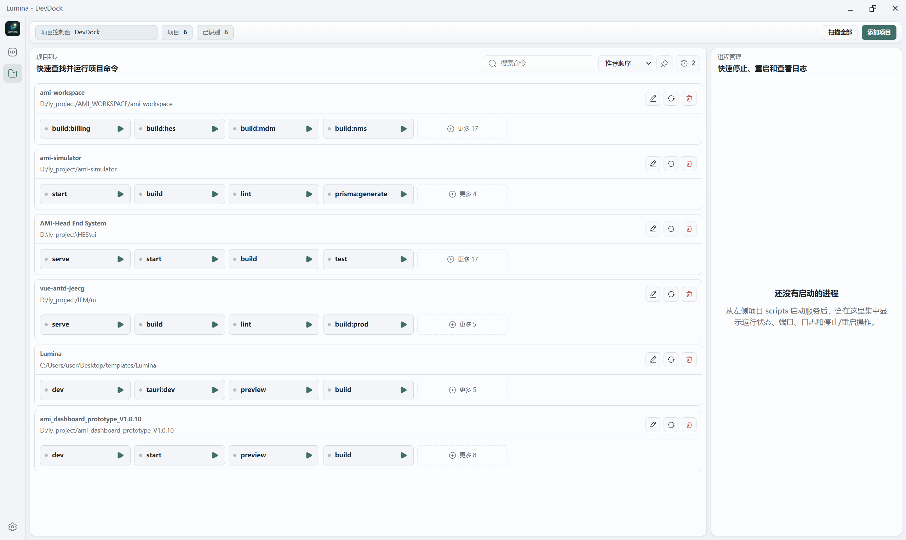

# Lumina 主界面审查

审查范围：Git Assistant 与 DevDock 的桌面宽屏默认状态。证据仅来自本次提供的两张截图。

## 1. Git Assistant

健康度：功能完整，但主任务顺序与页面顺序相反。

- 优点：仓库、分支和变更状态集中在顶栏；变更表格的信息密度合适；评分与变化类型容易扫描。
- 高优先级：用户必须先在页面下方选文件，才能回到上方生成提交说明，视线和操作路径来回跳。建议让变更浏览器成为第一工作区，提交编辑器在选择文件后展开或固定在下方。
- 高优先级：AI 侧栏把低频设置和高频动作混在一起，占据较大面积。模型、语言适合收进设置弹层，把“生成提交说明”放到标题输入附近。
- 中优先级：顶栏同时出现分支状态与分支按钮、同步状态与同步按钮、目录切换与刷新，层级偏平。仓库切换可合并进仓库身份区域，刷新改为图标动作。
- 中优先级：中英文标题混用；大量边框让表单、侧栏和表格视觉重量接近，主操作不够突出。
- 可访问性风险：部分辅助文字约 10–11px，问号和复选框点击区域偏小；仅凭截图无法确认键盘焦点和屏幕阅读器标签。

## 2. DevDock

健康度：任务结构清楚，但空状态和重复操作浪费了空间。

- 优点：项目、脚本和运行进程的左右分栏符合工作模型；每个脚本可以直接启动，路径和项目名关系清楚。
- 高优先级：没有运行进程时，右侧面板仍永久占据约五分之一宽度。建议空闲时折叠为窄栏或顶部状态条，有进程后再展开。
- 高优先级：每个项目卡片重复显示编辑、扫描和删除按钮，卡片高度较大。低频管理动作可收进菜单或仅在悬停时出现，提升同屏项目数量。
- 中优先级：脚本按钮外观几乎完全相同，启动、运行中和失败状态的区别不足。应把状态点、按钮色和动作图标统一成明确状态语言。
- 中优先级：“项目 6 / 已识别 6”信息价值较低，可只在异常时展示未识别数量；“扫描全部”应补充最近扫描时间或运行状态。
- 可访问性风险：路径和说明文字对比度偏低；图标按钮是否有可访问名称、脚本是否可用键盘操作无法从截图确认。

## 建议实施顺序

1. Git Assistant 调整为“选变更 → 生成/编辑说明 → 提交”的视觉顺序。
2. DevDock 空进程面板自适应折叠。
3. 两页统一顶栏操作分组和低频动作收纳。
4. 最后处理字体、边框、对比度和悬停细节。
