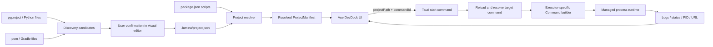
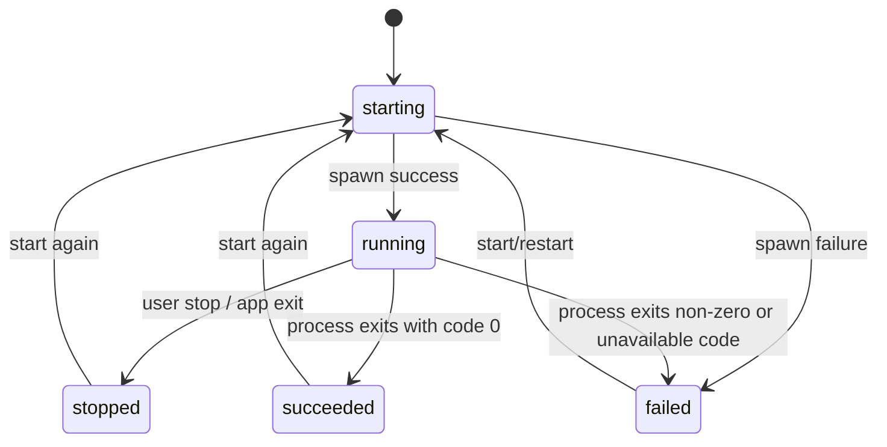
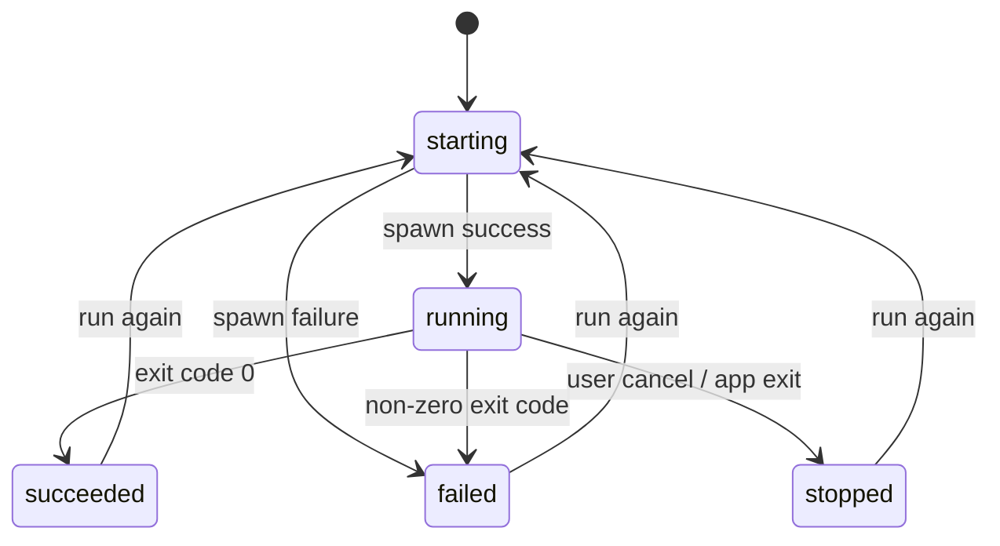

# Unified Project Commands Implementation Plan

> **For Claude:** REQUIRED SUB-SKILL: Use superpowers:executing-plans to implement this plan task-by-task.
>
> **For other implementation agents:** Read this document and the workspace `AGENTS.md` completely before editing. Execute tasks in order, preserve unrelated user changes, and do not run Build, Lint, browser automation, or visual browser verification unless the user explicitly authorizes it.

**Goal:** 将 Lumina DevDock 从仅支持 `package.json scripts` 的前端项目启动器，改造为支持前端、Python，并可平滑扩展到 Java 的统一项目命令与受控进程管理系统。

**Architecture:** 后端把 `.lumina/project.json`、`package.json scripts` 和自动发现结果解析为统一的 `ProjectCommand`。前端只传 `projectPath + commandId`，Rust 后端在每次执行前重新读取并校验目标命令，生成受控的 `std::process::Command`，再分别按 `service` 和 `task` 生命周期管理 PID、日志、退出码和访问地址。可视化配置器是主要入口，`.lumina/project.json` 是可提交到 Git、可共享、可手工编辑的底层配置。

**Tech Stack:** Vue 3、TypeScript、Tauri 2、Rust、Serde、Windows Process APIs/CLI、Node package managers、Python、后续 Maven/Gradle/Java。

---

## 1. 文档用途

这是一份架构规范和实施计划，不是概念草案。实施者应以本文中的类型、优先级、生命周期和验收标准为准；遇到本文未覆盖的产品选择时，不应自行扩大范围，应记录问题并与用户确认。

本文同时解决以下问题：

1. 一个项目可以拥有多个启动服务和一次性任务。
2. 前端、Python 和后续 Java 使用同一套命令与进程管理模型。
3. 现有前端项目无需创建 `.lumina/project.json` 也能继续工作。
4. 自动发现不会直接变成可执行命令，避免误执行测试文件或工具脚本。
5. 用户可以通过可视化界面生成和维护配置，降低 JSON 上手成本。
6. 执行前由 Rust 后端重新读取配置，防止前端缓存和磁盘配置不一致。
7. `service` 与 `task` 拥有不同的状态、操作和历史保留策略。

## 2. 当前实现基线

实施前先理解现有约束，不要在不了解当前行为的情况下整体重写。

### 2.1 Rust 项目扫描

文件：`src-tauri/src/commands/project.rs`

当前行为：

- `ProjectManifest` 强制包含 `package_json_path`、`package_manager` 和 `scripts`。
- `read_project_manifest` 要求项目根目录存在 `package.json`，否则返回错误。
- `ProjectScript` 只有 `name` 和 `command`。
- package manager 根据 `packageManager` 字段和 lock 文件推断。
- 技术栈只从 Node dependencies 中识别。

这部分需要演进为“项目描述 + 已解析命令 + 发现候选”，不能继续把 package.json 当作唯一 manifest。

### 2.2 Rust 进程管理

文件：`src-tauri/src/commands/project_process.rs`

当前行为：

- IPC payload 为 `project_path + project_name + script_name + package_manager`。
- 后端重新读取 package.json，确认脚本存在后执行 package manager command。
- 活动进程身份是 `project_path + script_name`。
- 只向前端返回 `running` 进程，已退出进程会在轮询时被清理。
- stdout/stderr 保存在内存环形队列中，默认最多 500 行。
- 从日志中启发式提取 URL 和端口。
- Windows 停止时先杀 PID 树，再杀所有占用检测端口的 PID。
- Lumina 退出时停止全部受管进程。

日志收集、PID 元数据、URL 识别、Windows 隐藏命令窗口等能力可以复用；命令解析、进程身份、task 历史和停止策略需要重构。

### 2.3 前端服务和界面

相关文件：

- `src/services/project/project-service.ts`
- `src/views/devdock/types.ts`
- `src/views/devdock/DevDockView.vue`
- `src/views/devdock/components/DevDockProjectList.vue`
- `src/views/devdock/components/DevDockProcessPanel.vue`
- `src/views/devdock/components/DevDockLogModal.vue`
- `src/views/devdock/components/DevDockRecentDrawer.vue`

当前行为：

- TypeScript 类型与 Rust 的 `ProjectScript`、`scriptName`、`packageManager` 强绑定。
- 置顶、最近使用、运行中判断以 `projectPath + scriptName` 为 key。
- 默认展示置顶脚本和前四个推荐脚本。
- 所有 scripts 都按“可启动、可停止”的长期服务处理。
- 非 `running` 进程会立即从前端进程列表移除。

这些状态需要迁移到 `commandId`，并在 UI 中区分服务和任务。

## 3. 目标与非目标

### 3.1 第一阶段目标

- 建立统一 `ProjectCommand` 领域模型。
- 支持 `service` 和 `task`。
- 保持所有现有 package.json scripts 可见、可执行。
- package scripts 自动适配为虚拟 commands，不要求用户修改项目。
- 支持 `.lumina/project.json` 的读取、校验和可视化编辑。
- 支持执行器：
  - `package-script`
  - `python`
  - `python-module`
  - `cmd`
  - `powershell`
- 支持 Python 解释器、工作目录、环境变量和参数数组。
- 支持 service 单实例、手动停止、手动重启。
- 支持 task 执行、取消、成功/失败结果、再次执行和日志保留。
- 自动发现 package scripts、Python 常见入口和常见项目元数据，但 Python 发现项必须经用户确认后才能执行。
- Lumina 退出时停止所有仍在运行的受管 service/task。

### 3.2 第二阶段目标：Java 一等支持

- 增加 `maven`、`gradle`、`java-jar` 执行器。
- 优先识别并使用 `mvnw.cmd`、`gradlew.bat`。
- 识别 `pom.xml`、`build.gradle`、`build.gradle.kts`、`settings.gradle`、`settings.gradle.kts`。
- 支持 Maven goal、Gradle task、Spring Boot run、明确路径的 JAR。
- Java 自动发现结果同样必须由用户确认。

### 3.3 暂不实现

- 任意自由字符串 `shell` 执行器。
- Docker、Docker Compose。
- service 自动重启和守护进程模式。
- Lumina 退出后让受管服务脱离运行。
- 完整任务依赖图、循环依赖检测、并行 DAG 调度。
- 自动选择多个 Java 构建产物中的正确 JAR。
- 自动读取 IntelliJ IDEA Run Configuration。
- Java 多模块项目的复杂入口推断。
- 自动执行 `pip install`、`npm install`、Maven/Gradle 依赖安装。
- 扫描后自动执行任何命令。
- 操作系统级安全沙箱。

## 4. 非功能要求

### 4.1 性能

- 应用启动时允许先显示本地缓存，再后台刷新项目 manifest。
- 项目扫描保持有限并发，初始建议沿用当前并发数 3。
- 每次执行前只重新读取目标项目所需的少量配置文件，不重新扫描整个工作区。
- `.lumina/project.json`、package.json、pyproject.toml 等文件应根据修改时间或内容指纹避免不必要的重复解析。
- 日志队列仍需有上限，第一版可沿用每次运行 500 行；后续可改为内存窗口加磁盘日志。

### 4.2 可靠性

- 配置错误必须在 spawn 之前返回，不能出现“部分启动”。
- task 必须保存退出码、结束时间和最终状态。
- service 自己退出时必须显示退出结果，不能静默消失。
- 重启失败后必须保留清晰错误，不能把旧进程错误地标为仍在运行。
- 配置文件变更不影响已经运行的进程；只在下一次启动/重启时生效。

### 4.3 安全

- Tauri 前端不得传完整 executable 或命令字符串。
- 后端只接受项目路径、命令 ID，以及未来确有必要的结构化运行选项。
- 后端每次执行前重新读取并校验配置。
- 不自动执行自动发现候选。
- 第一次执行项目配置命令时展示命令预览和来源。
- 环境变量中的敏感值不得出现在运行摘要、错误日志或最近命令中。
- 脚本和 working directory 默认必须位于项目根目录内。
- interpreter、Java Home 等运行时路径可以位于项目外，但要显式解析并检查存在性。
- 第一版停止命令不允许根据日志检测到的端口直接杀死任意进程。

### 4.4 可维护性

- Rust 侧使用 enum/discriminated model，避免用任意字符串判断 executor 和 kind。
- 命令来源、解析、校验、Command 构造、进程运行分层，不要全部堆进 `project_process.rs`。
- 前后端字段使用相同含义，Rust `serde(rename_all = "camelCase")` 与 TypeScript 对齐。
- 新语言通过增加 resolver/executor 扩展，不复制整套进程管理逻辑。

## 5. 核心架构



推荐 Rust 模块边界：

```text
src-tauri/src/commands/
├─ project.rs                 Tauri 查询/保存入口，尽量薄
├─ project_process.rs         Tauri 运行控制入口，逐步拆薄
└─ project/
   ├─ mod.rs
   ├─ models.rs              配置、manifest、command、candidate 类型
   ├─ config.rs              .lumina/project.json 读取、校验、保存
   ├─ resolver.rs            合并显式配置和虚拟命令
   ├─ discovery.rs           技术栈与候选发现编排
   ├─ package.rs             package.json 解析与 package commands
   ├─ python.rs              Python runtime 和候选识别
   ├─ java.rs                第二阶段 Java 识别
   └─ executor.rs            ResolvedCommand -> std::process::Command
```

如果实施者认为一次移动 `project.rs` 风险太高，可以先在 `commands` 目录下使用平铺文件，完成后再整理；不得为了目录美观同时重写无关逻辑。

## 6. 配置文件规范

文件位置：

```text
<project-root>/.lumina/project.json
```

第一版完整示例：

```json
{
  "schemaVersion": 1,
  "name": "ami-insight",
  "types": ["frontend", "python"],
  "workingDirectory": ".",
  "environment": {
    "PYTHONUNBUFFERED": "1"
  },
  "runtimes": {
    "python": {
      "interpreter": ".venv\\Scripts\\python.exe"
    }
  },
  "commands": [
    {
      "id": "api",
      "name": "Uvicorn 开发服务",
      "kind": "service",
      "executor": "python-module",
      "module": "uvicorn",
      "args": ["app:app", "--host", "127.0.0.1", "--port", "8000"],
      "workingDirectory": ".",
      "environment": {},
      "runPolicy": "singleton"
    },
    {
      "id": "compile",
      "name": "编译 Python 扩展",
      "kind": "task",
      "executor": "powershell",
      "script": "scripts/compile.ps1",
      "args": [],
      "runPolicy": "singleton"
    }
  ],
  "commandOverrides": {
    "package:dev": {
      "name": "前端开发服务",
      "kind": "service"
    },
    "package:build": {
      "name": "前端构建",
      "kind": "task"
    }
  },
  "defaults": {
    "serviceCommandId": "api"
  }
}
```

### 6.1 顶层字段

| 字段               | 必填 | 说明                                                    |
| ------------------ | ---: | ------------------------------------------------------- |
| `schemaVersion`    |   是 | 第一版固定为 `1`，未知版本返回可读错误                  |
| `name`             |   否 | 项目展示名；用户在 Lumina 中设置的本地别名仍优先        |
| `types`            |   否 | 仅用于展示/筛选，不决定执行逻辑                         |
| `workingDirectory` |   否 | 默认 `.`，相对于项目根目录                              |
| `environment`      |   否 | 所有显式 commands 的基础环境变量，命令级字段覆盖同名项  |
| `runtimes`         |   否 | Python/Java 等运行时默认配置                            |
| `commands`         |   否 | 用户显式确认、可执行的命令                              |
| `commandOverrides` |   否 | 覆盖 package.json 等虚拟 command 的展示和生命周期元数据 |
| `defaults`         |   否 | 项目卡片默认 service 等偏好                             |

### 6.2 命令 ID

- 显式 command 的 `id` 在同一个配置中必须唯一。
- 建议允许字符：ASCII 字母、数字、`-`、`_`、`.`。
- 保留带冒号的来源命名空间，不允许显式配置抢占：
  - `package:<scriptName>`
  - 后续 `maven:<goal>`
  - 后续 `gradle:<task>`
- 运行时真正的唯一身份是规范化项目路径加 resolved command ID。
- localStorage 和进程状态都必须从 `scriptName` 迁移到 `commandId`。

### 6.3 kind

```rust
pub enum ProjectCommandKind {
    Service,
    Task,
}
```

- `service`：预期持续运行，UI 提供启动、停止、重启、日志和访问地址。
- `task`：预期自行退出，UI 提供执行、取消、再次执行、退出码、耗时和日志。
- 不支持未知值回退；未知值是配置错误。

### 6.4 runPolicy

第一版只实现：

```text
singleton
```

配置类型可以预留 `parallel`，但如果第一版运行时未实现，解析器必须明确拒绝，不能静默当作 singleton。

`singleton` 语义：相同规范化项目路径和 command ID 已有活动运行时，再次启动直接返回现有运行快照，不产生第二个进程。

### 6.5 环境变量

合并顺序：

```text
父进程环境
  < 项目级 environment
  < command 级 environment
```

第一版不自动读取 `.env`，避免不明确的加载顺序和秘密泄露。未来如支持 `.env`，必须通过显式字段配置。

配置器允许把环境变量标为敏感。第一版如果不设计独立 secret store，至少按变量名启发式脱敏：

```text
TOKEN
SECRET
PASSWORD
PASSWD
API_KEY
PRIVATE_KEY
```

脱敏只影响展示，传给子进程的实际值不变。

### 6.6 路径解析

路径解析规则必须统一：

1. canonicalize 项目根目录。
2. 相对 `workingDirectory` 基于项目根目录解析。
3. 相对 script 路径基于命令最终 working directory 解析，或者统一基于项目根目录；实现前二选一并写入错误提示。推荐统一基于项目根目录，减少语义歧义。
4. script 和 working directory canonicalize 后必须仍位于项目根目录。
5. Python interpreter 可以是：
   - 项目相对路径；
   - 绝对路径；
   - PATH 中的程序名，例如 `python`、`py`。
6. 路径不存在时在 spawn 前返回字段级错误。
7. 注意 Windows 路径大小写、`/` 与 `\`、符号链接和 UNC path。

## 7. 类型设计

以下是目标模型示意。实施者可以按 Rust 编译约束拆分类型，但不得退回松散 `serde_json::Value` 驱动执行。

```rust
#[derive(Debug, Clone, Serialize, Deserialize)]
#[serde(rename_all = "camelCase")]
pub struct LuminaProjectConfig {
    pub schema_version: u32,
    pub name: Option<String>,
    #[serde(default)]
    pub types: Vec<String>,
    pub working_directory: Option<String>,
    #[serde(default)]
    pub environment: HashMap<String, String>,
    #[serde(default)]
    pub runtimes: ProjectRuntimes,
    #[serde(default)]
    pub commands: Vec<ProjectCommandConfig>,
    #[serde(default)]
    pub command_overrides: HashMap<String, ProjectCommandOverride>,
    #[serde(default)]
    pub defaults: ProjectCommandDefaults,
}

#[derive(Debug, Clone, Serialize, Deserialize)]
#[serde(rename_all = "kebab-case")]
pub enum ProjectCommandKind {
    Service,
    Task,
}

#[derive(Debug, Clone, Serialize, Deserialize)]
#[serde(rename_all = "kebab-case")]
pub enum ProjectRunPolicy {
    Singleton,
}
```

Executor 建议使用 Serde tagged enum，确保每种 executor 只能携带合法字段：

```rust
#[derive(Debug, Clone, Serialize, Deserialize)]
#[serde(tag = "executor", rename_all = "kebab-case")]
pub enum ProjectCommandConfig {
    PackageScript {
        id: String,
        name: String,
        kind: ProjectCommandKind,
        script: String,
        #[serde(default)]
        args: Vec<String>,
    },
    Python {
        id: String,
        name: String,
        kind: ProjectCommandKind,
        script: String,
        #[serde(default)]
        args: Vec<String>,
    },
    PythonModule {
        id: String,
        name: String,
        kind: ProjectCommandKind,
        module: String,
        #[serde(default)]
        args: Vec<String>,
    },
    Cmd {
        id: String,
        name: String,
        kind: ProjectCommandKind,
        script: String,
        #[serde(default)]
        args: Vec<String>,
    },
    Powershell {
        id: String,
        name: String,
        kind: ProjectCommandKind,
        script: String,
        #[serde(default)]
        args: Vec<String>,
    },
}
```

如果字段重复过多，可以使用 flatten 的公共字段，但序列化后的 JSON 必须保持本文示例的扁平结构。

前端对应类型必须是 discriminated union：

```ts
export type ProjectCommandKind = 'service' | 'task'
export type ProjectCommandSource = 'config' | 'package-json'
export type ProjectCommandExecutor =
  | 'package-script'
  | 'python'
  | 'python-module'
  | 'cmd'
  | 'powershell'

export interface ProjectCommand {
  id: string
  name: string
  kind: ProjectCommandKind
  executor: ProjectCommandExecutor
  source: ProjectCommandSource
  sourceLabel: string
  commandPreview: string
  workingDirectory: string
  runPolicy: 'singleton'
}
```

返回给前端的 `ProjectCommand` 是已经解析、可展示的 manifest command，不应包含未脱敏的环境变量值。

## 8. 命令来源和合并规则

第一版有三类来源：

### 8.1 显式配置命令

来源：`.lumina/project.json -> commands`

- 用户已经明确配置或在可视化配置器中确认。
- 可执行。
- resolved ID 建议为 `config:<id>`，但 UI 可继续展示原始短 ID。

### 8.2 package.json 虚拟命令

来源：`package.json -> scripts`

- 自动转为 `package-script` executor。
- 无需写入 `.lumina/project.json`。
- ID 为 `package:<scriptName>`。
- package manager 由后端读取 package.json 和 lock 文件决定，前端不再传。
- `commandOverrides` 只覆盖 name、kind、默认展示等 Lumina 元数据，不复制原 script command 内容。

默认 kind 启发式：

```text
service: dev, start, serve, preview, watch，以及名称以 :watch 结尾
task: build, lint, format, test, typecheck, check, generate
```

无法确定时默认 `task` 更安全，并在 UI 标记“请确认类型”。如果为了完全兼容当前行为决定默认 service，必须在实现前让用户确认；不得静默做这个产品变更。

### 8.3 自动发现候选

来源：Python/Java 文件和元数据扫描。

- 返回 `ProjectCommandCandidate[]`。
- 不进入可执行 `commands`。
- 用户在配置器确认后，写入显式 `commands`。
- candidate 必须包含 confidence、reason 和 source。

```ts
export interface ProjectCommandCandidate {
  suggestedId: string
  name: string
  kind: ProjectCommandKind
  executor: ProjectCommandExecutor
  confidence: 'high' | 'medium' | 'low'
  reason: string
  source: string
  draft: Record<string, unknown>
}
```

## 9. 执行前重新读取策略

### 9.1 决策

- UI 展示使用缓存 manifest，并允许后台刷新。
- 用户执行时，Rust 后端始终重新读取目标项目配置。
- 不提供“关闭执行前重读”的用户开关。
- 不在每次执行时重新扫描所有项目。
- 重启按磁盘最新配置重新解析 command。

### 9.2 原因

配置文件很小，单项目定点读取成本远低于启动 Python、Node 或 Java 进程的成本。关闭重读会引入“UI 显示一版、内存执行另一版、磁盘又是第三版”的不可诊断状态。

### 9.3 配置变化行为

- 运行中的 service 不热更新。
- 修改配置后，项目卡片应提示“配置已变化，重新扫描后生效”或自动后台刷新。
- 重启 service 时使用最新配置。
- 运行元数据保存本次 resolved command 的脱敏快照，日志窗口展示实际执行信息。

## 10. Executor 规范

所有 executor 最终生成：

```rust
pub struct ResolvedCommand {
    pub command_id: String,
    pub command_name: String,
    pub kind: ProjectCommandKind,
    pub executor: ProjectCommandExecutor,
    pub program: PathBuf,
    pub args: Vec<OsString>,
    pub working_directory: PathBuf,
    pub environment: HashMap<OsString, OsString>,
    pub command_preview: String,
    pub config_revision: String,
}
```

`command_preview` 必须脱敏，只用于展示；spawn 必须使用 `program + args`，不能重新执行 preview 字符串。

### 10.1 package-script

Windows：

```text
cmd.exe /D /S /C <package-manager> run <script>
```

保留当前 package manager 识别策略，但 package manager 必须由后端重新解析，不接受前端值。

需要继续保护：

```text
npm_config_yes=false
```

防止受管脚本中的 npx 静默下载依赖并拉起未跟踪终端。

### 10.2 python

```text
<interpreter> <script> <args...>
```

解释器优先级：

1. command 级未来覆盖字段；第一版可不提供。
2. `runtimes.python.interpreter`。
3. 自动发现的项目解释器，只用于配置器建议，不能未经确认静默写入配置。
4. 系统 `python`。

### 10.3 python-module

```text
<interpreter> -m <module> <args...>
```

`module` 不能为空；第一版建议限制为 Python module name 可接受字符，不允许 shell metacharacter。

### 10.4 cmd

支持 `.cmd` 和 `.bat`。脚本路径必须校验在项目目录内。

Windows shell 对引号有特殊规则，必须为包含空格、`&`、括号的路径和参数补测试。不能简单使用不受控的 `format!("{} {}", script, args.join(" "))`。

### 10.5 powershell

第一版默认：

```text
powershell.exe -NoProfile -File <script> <args...>
```

- 不默认加入 `-ExecutionPolicy Bypass`。
- 若系统策略阻止执行，返回可理解错误，由用户决定是否调整配置或系统策略。
- PowerShell 7 (`pwsh`) 支持可作为后续配置项，第一版不要隐式切换导致环境差异。

### 10.6 第一版不提供 shell

自由 shell 字符串会绕过参数数组、路径校验和 executor 类型约束。需要 Bash/Zsh 时，应在后续设计显式 `shell + script + args`，不能加入任意 `command` 字符串作为逃生口。

## 11. Service 和 Task 生命周期

### 11.1 统一运行状态

```ts
export type ProjectRunState =
  | 'starting'
  | 'running'
  | 'succeeded'
  | 'failed'
  | 'stopped'
  | 'unknown'
```

### 11.2 service 状态机



规则：

- 默认 `singleton`。
- 不自动重启。
- 用户点击重启：停止旧运行，删除活动占用，重新读取最新配置并启动新 run ID。
- service 自行退出后保留最近一次结果，但不再算活动服务。
- Lumina 退出时停止所有运行中的受管服务。

### 11.3 task 状态机



规则：

- 运行中按钮显示“取消”。
- 完成后显示状态、退出码、耗时和“再次执行”。
- task 不提供“重启”术语。
- task 不使用端口存活来覆盖退出状态。
- task 结果必须至少在本次 Lumina 会话内保留。
- 第一版每个 command 保留最近一次 run 即可；全量历史不是第一版目标。

### 11.4 进程身份

活动唯一键：

```text
canonicalProjectPath + resolvedCommandId
```

运行记录另有唯一 `runId`：

```text
run-<timestamp>-<counter>
```

`processId` 建议逐步重命名为 `runId`，因为已完成 task 仍然是一条运行记录，但不再有活动 process。

## 12. 停止策略与端口

### 12.1 第一版决策

- 停止时杀受管 PID 和其子进程树。
- 保留 URL/端口日志检测，用于 UI 展示。
- 不根据启发式检测的端口自动杀任意 PID。
- 不因为检测端口仍在监听，就把已退出 task 改回 running。
- service PID 树停止后端口仍占用时，返回 warning，而不是自动误杀。

### 12.2 UI 行为

如果停止后端口仍被占用：

```text
服务进程已停止，但端口 8000 仍被 PID 12345 占用。
[复制 PID] [刷新状态]
```

第一版可以只显示警告，不实现“强制停止端口进程”。若后续增加该按钮，必须二次确认，并尽可能验证占用 PID 与原受管进程树的关系。

## 13. 进程元数据与 IPC

### 13.1 启动 payload

目标 payload：

```rust
#[derive(Debug, Deserialize)]
#[serde(rename_all = "camelCase")]
pub struct StartProjectCommandPayload {
    pub project_path: String,
    pub command_id: String,
}
```

不要保留：

- `project_name`
- `script_name`
- `package_manager`
- 前端传入的完整 command
- 前端传入的 interpreter

项目本地别名仅用于前端展示，不应影响执行解析。

### 13.2 运行快照

```rust
pub struct ProjectRunSnapshot {
    pub id: String,
    pub project_path: String,
    pub project_name: String,
    pub command_id: String,
    pub command_name: String,
    pub kind: ProjectCommandKind,
    pub executor: ProjectCommandExecutor,
    pub command_preview: String,
    pub working_directory: String,
    pub pid: Option<u32>,
    pub status: ProjectRunStatus,
    pub started_at: u128,
    pub finished_at: Option<u128>,
    pub exit_code: Option<i32>,
    pub ports: Vec<u16>,
    pub urls: Vec<String>,
    pub log_count: usize,
    pub last_log_line: Option<String>,
    pub config_revision: String,
    pub warning: Option<String>,
}
```

完成后的 task 可以没有活动 PID，因此 `pid` 必须是 optional，不能继续强制为 `u32`。

### 13.3 Tauri commands

建议最终接口：

```text
load_project_manifest(projectPath)
load_project_config(projectPath)
save_project_config(projectPath, config)
discover_project_commands(projectPath)
start_project_command(payload)
list_project_runs()
stop_project_run(runId)
restart_project_service(runId)
rerun_project_task(runId)
load_project_run_logs(runId)
stop_all_project_runs()
```

可以保留旧 Tauri command 名并渐进迁移，但最后 TypeScript API 中不得继续暴露 scriptName/packageManager 模型。

### 13.4 错误分类

第一版若不引入结构化 error enum，错误文本至少必须包含稳定前缀：

```text
CONFIG_NOT_FOUND
CONFIG_INVALID
COMMAND_NOT_FOUND
COMMAND_INVALID
EXECUTOR_UNAVAILABLE
WORKING_DIRECTORY_INVALID
SCRIPT_OUTSIDE_PROJECT
SPAWN_FAILED
RUN_NOT_FOUND
RUN_ALREADY_ACTIVE
STOP_FAILED
```

更推荐返回：

```ts
interface ProjectCommandError {
  code: string
  message: string
  field?: string
  details?: string
}
```

如果改变全局错误处理成本过大，可以第一版仍返回字符串，但必须集中构造错误，避免前端依赖中文文本判断逻辑。

## 14. 自动发现

### 14.1 package.json

- 读取全部 string scripts。
- 生成虚拟 executable commands。
- 检测 package manager。
- 识别常见技术栈用于项目标签。
- 不写 `.lumina/project.json`。

### 14.2 Python

优先检查：

```text
.venv/Scripts/python.exe
venv/Scripts/python.exe
pyproject.toml
uv.lock
poetry.lock
Pipfile
requirements*.txt
main.py
app.py
server.py
run.py
manage.py
*.cmd
*.bat
*.ps1
```

候选规则：

- `[project.scripts]`：高置信度，但仍需确认如何调用。
- Poetry scripts：高置信度。
- `manage.py`：中高置信度，建议 Django `python manage.py runserver`，不要生成 `python -m django` 作为唯一推荐。
- `main.py`、`app.py`、`server.py`、`run.py`：中置信度 Python script candidate。
- 检测到 FastAPI/Uvicorn 依赖：只给出 Uvicorn candidate；除非可靠识别 `module:app`，否则让用户补充入口。
- `.cmd/.bat/.ps1`：中置信度脚本 candidate，不自动添加全部深层脚本。
- `test_*.py`、`*_test.py`、`setup.py`、迁移脚本默认不作为 service 候选。
- 不递归把所有 `.py` 文件暴露为启动入口。

### 14.3 Java 第二阶段

优先检查：

```text
mvnw.cmd
gradlew.bat
pom.xml
build.gradle
build.gradle.kts
settings.gradle
settings.gradle.kts
```

候选：

- Maven `spring-boot:run` service。
- Gradle `bootRun` service。
- Maven `package`、`test` task。
- Gradle `build`、`test` task。
- 明确配置路径的 `java -jar` service。

不要在第一版 Java 支持里自动运行 build 再猜 JAR。

## 15. 可视化配置器

### 15.1 产品原则

- 可视化配置是主要入口。
- JSON 是底层存储和团队共享格式。
- 用户不需要先了解 executor 字段才能创建 command。
- 表单保存前必须调用后端校验。
- 所有危险操作在保存或执行前展示实际含义。

### 15.2 入口

项目卡片增加：

```text
[配置运行方式]
```

没有 `.lumina/project.json` 时：

```text
已自动识别 package.json commands。
还发现 2 个 Python 启动候选。
[查看并配置]
```

### 15.3 页面结构

推荐使用抽屉或大尺寸 modal，分为：

1. 项目设置
2. 运行环境
3. 服务
4. 一次性任务
5. 自动发现候选
6. 配置预览/校验

简单模式字段：

```text
名称
类型：持续服务 / 一次性任务
执行方式
脚本或模块
参数列表
工作目录
```

高级模式字段：

```text
环境变量
运行时路径
运行策略
显式端口（先只用于展示）
来源和命令预览
```

### 15.4 参数编辑

参数必须按数组逐项编辑：

```text
app:app
--host
127.0.0.1
--port
8000
```

不提供单行 shell command 输入框。

### 15.5 保存行为

- 保存前调用 Rust 校验。
- 文件不存在时创建 `.lumina` 目录和 `project.json`。
- 只保存用户显式 commands、overrides、runtime 设置和项目设置。
- 不把 package scripts 的 command 内容复制进配置。
- 写入使用稳定缩进和字段顺序，减少 Git diff 噪音。
- 保存失败时保留表单内容。
- 保存成功后重新加载 manifest。

### 15.6 命令预览

执行前展示：

```text
来源：.lumina/project.json
程序：D:\project\.venv\Scripts\python.exe
参数：-m uvicorn app:app --port 8000
目录：D:\project
环境：PYTHONUNBUFFERED=1, API_TOKEN=••••••
```

preview 仅用于用户理解，不得作为实际 shell command 再执行。

## 16. DevDock UI 改造

项目卡片分组：

```text
ami-insight                         PYTHON · FRONTEND
D:\ly_project\ami-insight

启动服务
  Uvicorn 开发服务       运行中 · :8000    [停止]
  前端开发服务                             [启动]
  [更多启动方式]

任务
  前端构建               上次成功 · 12s    [执行]
  格式检查               上次失败 · code 1 [再次执行]

[配置运行方式]
```

### 16.1 默认展示

- `defaults.serviceCommandId` 对应的服务放第一位。
- 置顶项继续优先。
- service 和 task 分别折叠，不混为一列。
- package scripts 仍参与搜索、排序和最近使用。

### 16.2 按钮文案

| kind/status                   | 主操作   |
| ----------------------------- | -------- |
| service idle/exited           | 启动     |
| service starting              | 启动中   |
| service running               | 停止     |
| service failed                | 重新启动 |
| task idle                     | 执行     |
| task running                  | 取消     |
| task succeeded/failed/stopped | 再次执行 |

### 16.3 进程面板

进程面板建议逐步更名为“运行记录”或“运行中心”，因为它将同时展示已完成 task。

分组：

```text
运行中
最近完成
```

第一版最多保留最近 20 或 40 条记录；可以沿用当前 `PROCESS_LIMIT = 40`。

## 17. 配置信任边界

`.lumina/project.json` 和 package.json scripts 都是本机代码执行描述，不是纯展示数据。

第一版信任模型：

- 添加项目只授权读取，不授权自动执行。
- 用户明确点击 command 才执行。
- 自动发现 candidate 永不直接执行。
- 第一次执行来源于项目文件的 command 时，可显示确认对话框。
- 确认内容包含来源、program、args、working directory 和脱敏环境。
- 配置的 program/script/working directory 变化后，可根据 `configRevision` 重新提示。
- 不把“前端只传 commandId”描述成完整沙箱；恶意项目配置本身仍可能执行恶意脚本。

`configRevision` 建议使用参与解析文件的内容 hash，或第一版使用稳定序列化后 hash。不要使用随机值，否则每次扫描都会触发变化。

## 18. package.json 兼容与迁移

### 18.1 项目文件兼容

- 现有前端项目无需新增文件。
- package scripts 自动变为 `package:<scriptName>` commands。
- package manager 继续自动检测。
- `.lumina/project.json` 只存覆盖元数据，不复制 script command。

### 18.2 localStorage 迁移

现有数据：

```text
lumina.devdock.pinnedScripts
lumina.devdock.recentCommands
lumina.devdock.scriptSort
```

迁移规则：

```text
projectPath + scriptName
    ->
projectPath + package:<scriptName>
```

建议创建新的版本化 key：

```text
lumina.devdock.pinnedCommands.v1
lumina.devdock.recentCommands.v1
lumina.devdock.commandSort.v1
```

启动时：

1. 新 key 存在：直接读取。
2. 新 key 不存在、旧 key 存在：转换并写入新 key。
3. 保留旧 key，不主动删除，便于回滚旧版本。
4. 损坏数据忽略并通过现有 `reportError` 记录，不阻断 DevDock。

### 18.3 API 渐进迁移

建议先新增 command API，再切换 UI，最后删除旧 script API。不要在同一个大改动中先删旧接口导致界面长时间不可用。

## 19. Java 扩展设计

第二阶段新增 executor：

```text
maven
gradle
java-jar
```

示例：

```json
{
  "id": "spring-boot",
  "name": "Spring Boot",
  "kind": "service",
  "executor": "maven",
  "args": ["spring-boot:run"],
  "runPolicy": "singleton"
}
```

```json
{
  "id": "build",
  "name": "Gradle 构建",
  "kind": "task",
  "executor": "gradle",
  "args": ["build"],
  "runPolicy": "singleton"
}
```

```json
{
  "id": "app-jar",
  "name": "运行应用 JAR",
  "kind": "service",
  "executor": "java-jar",
  "jar": "build/libs/app.jar",
  "args": ["--spring.profiles.active=dev"]
}
```

解析优先级：

```text
maven: mvnw.cmd > PATH 中 mvn
gradle: gradlew.bat > PATH 中 gradle
java: runtimes.java.javaHome/bin/java.exe > PATH 中 java
```

Java 接入不应修改 service/task runtime，只增加 executor builder 和 discovery provider。

## 20. ADR 决策记录

### ADR-001：统一使用 ProjectCommand

**状态：** Accepted

**背景：** 当前 ProjectScript 只能描述 package.json script，无法自然表达 Python、Java、CMD、PowerShell 和一次性任务。

**决策：** 使用 `ProjectCommand` 作为统一领域对象，顶层配置字段使用 `commands`，kind 为 `service | task`。

**正面影响：** 所有语言复用进程管理；UI 术语一致；后续 executor 可插拔。

**负面影响：** 需要迁移现有 TypeScript/Rust 类型和 localStorage。

**替代方案：** 为 Python/Java 各自新增启动脚本模型。拒绝，因为会复制启停、日志和 UI 逻辑。

### ADR-002：执行前重新读取目标配置

**状态：** Accepted

**决策：** UI manifest 可缓存，执行/重启前后端始终定点重读并解析目标 command；不提供关闭开关。

**正面影响：** Git 切分支、外部编辑配置后不会执行陈旧命令。

**负面影响：** 每次执行增加一次小文件 IO。

**替代方案：** 只使用应用启动时缓存。拒绝，因为状态漂移难诊断。

### ADR-003：package scripts 使用虚拟适配，不复制配置

**状态：** Accepted

**决策：** package.json scripts 动态映射为 `package:<name>` command；`.lumina/project.json` 只存 overrides。

**正面影响：** 零迁移；package.json 保持单一事实来源。

**负面影响：** resolver 需要合并多个来源。

### ADR-004：第一版按 PID 树停止，不按检测端口强杀

**状态：** Accepted

**决策：** 端口用于展示和警告；停止只针对受管 PID 树。

**正面影响：** 避免误杀数据库和其他项目服务。

**负面影响：** 极少数脱离进程树的服务可能残留，需要用户手动处理。

### ADR-005：可视化配置为主入口

**状态：** Accepted

**决策：** 用户主要通过表单维护配置，保存为 `.lumina/project.json`；高级 JSON 编辑器暂缓。

**正面影响：** 降低路径、参数和 executor 的理解成本；配置仍可版本控制。

**负面影响：** 需要额外表单校验和 source merge UI。

### ADR-006：前端/Python 先交付，Java 在统一底座后接入

**状态：** Accepted

**决策：** 第一阶段完成 package、Python、CMD、PowerShell；第二阶段增加 Maven/Gradle/Java JAR。

**正面影响：** 降低首批变更面，先验证模型。

**负面影响：** Java 用户需要等待第二阶段或先使用 cmd/PowerShell wrapper。

## 21. 失败模式和处理

| 失败模式                  | 预期行为                                                   |
| ------------------------- | ---------------------------------------------------------- |
| project.json JSON 无效    | 项目仍可展示 package scripts；显式 commands 区显示配置错误 |
| schemaVersion 未知        | 不执行显式 commands，提示升级 Lumina 或配置                |
| command ID 重复           | 整个显式 commands 配置校验失败，指出重复 ID                |
| 默认 service ID 不存在    | 配置器标红；manifest 可加载其他 commands                   |
| Python interpreter 不存在 | spawn 前报错，并提供重新选择解释器入口                     |
| script 超出项目目录       | 拒绝执行，返回 `SCRIPT_OUTSIDE_PROJECT`                    |
| working directory 不存在  | 拒绝执行                                                   |
| package script 被外部删除 | 执行前重读后返回 `COMMAND_NOT_FOUND`，前端刷新 manifest    |
| service 自行退出          | 保留 failed/succeeded 快照和日志，不继续显示为运行中       |
| task 快速退出             | 仍能看到最终状态和日志，不被轮询立即删除                   |
| 停止后端口仍占用          | service 标为 stopped，并附 warning，不自动杀端口 PID       |
| 日志 mutex poisoned       | 状态返回 unknown 或空日志，同时记录内部错误，不 panic      |
| 配置保存失败              | 保留表单草稿，显示具体文件系统错误                         |
| localStorage 旧数据损坏   | 忽略坏记录并继续启动 DevDock                               |

## 22. 实施任务

下面任务应按顺序执行。每个任务完成后保持变更可审查；不要把所有层一次性改完后再测试。

### Task 1：建立统一 Rust 领域模型和配置解析器

**Files:**

- Create: `src-tauri/src/commands/project/models.rs`
- Create: `src-tauri/src/commands/project/config.rs`
- Create or Modify: `src-tauri/src/commands/project/mod.rs`
- Modify: `src-tauri/src/commands/project.rs`，若采用目录模块则迁移入口
- Test: 与实现同文件的 `#[cfg(test)]` 单元测试，或 `src-tauri/src/commands/project/tests.rs`

**Steps:**

1. 为 schema version、kind、run policy、runtimes、commands、overrides 和 defaults 写反序列化测试。
2. 覆盖有效配置、未知 schema、重复 ID、非法默认 ID、executor 缺字段。
3. 实现强类型 Serde 模型。
4. 实现 `.lumina/project.json` 读取；文件不存在返回默认空配置，而不是项目扫描失败。
5. 实现字段级校验和稳定错误 code。
6. 测试 Windows 相对路径和包含空格的项目路径。
7. 提交前只运行获得用户授权的聚焦测试命令；建议命令：

```powershell
cargo test --manifest-path src-tauri/Cargo.toml commands::project
```

预期：新增配置解析测试全部通过，现有项目命令测试不回归。

### Task 2：把 package.json scripts 适配为 ProjectCommand

**Files:**

- Create: `src-tauri/src/commands/project/package.rs`
- Create: `src-tauri/src/commands/project/resolver.rs`
- Modify: `src-tauri/src/commands/project.rs` 或新模块入口
- Test: package/resolver 单元测试

**Steps:**

1. 写 package scripts 到 `package:<name>` commands 的失败测试。
2. 测试 package manager 识别保持现有行为。
3. 测试 command override 只覆盖元数据，不覆盖 package script 内容。
4. 实现 package command adapter。
5. 实现 command source 合并和稳定排序。
6. 保证没有 project.json 的现有前端项目仍能 load manifest。
7. 保证没有 package.json 但有 project.json 的 Python 项目也能 load manifest。

### Task 3：扩展 ProjectManifest 和 TypeScript API

**Files:**

- Modify: `src/services/project/project-service.ts`
- Modify: `src/views/devdock/types.ts`
- Modify: Rust manifest serialize types

**Steps:**

1. 定义 `ProjectCommand`、`ProjectCommandCandidate`、`ProjectRunSnapshot` 和 status 类型。
2. manifest 返回 `commands`、`candidates`、`detectedTypes`、`configState`。
3. 暂时保留旧 scripts 字段或提供 adapter，避免 UI 在中间提交中完全不可用。
4. 新增 `startProjectCommand({ projectPath, commandId })` API。
5. 不让 TypeScript API 接受 `packageManager`、`scriptName` 或完整 command。

### Task 4：实现 executor resolver

**Files:**

- Create: `src-tauri/src/commands/project/executor.rs`
- Modify: `src-tauri/src/commands/project_process.rs`
- Test: executor 单元测试

**Steps:**

1. 为 package-script、python、python-module、cmd、powershell 分别写 command 构造测试。
2. 覆盖空格路径、Unicode 路径、参数中空格、空参数、工作目录覆盖。
3. 覆盖 script 越界、working directory 越界、解释器不存在。
4. 实现 `ResolvedCommand`。
5. spawn 只使用 program 和结构化 args。
6. command preview 单独生成并脱敏。
7. 保留 Windows `CREATE_NO_WINDOW`、stdin null、stdout/stderr pipe。

### Task 5：重构运行时支持 service/task

**Files:**

- Modify: `src-tauri/src/commands/project_process.rs`
- Optionally Create: `src-tauri/src/commands/project/runtime.rs`
- Modify: `src-tauri/src/commands/mod.rs`
- Modify: `src-tauri/src/lib.rs`
- Test: process runtime 单元/集成测试

**Steps:**

1. 将 meta 从 script 字段迁移到 command 字段。
2. 把 PID 改成完成后允许为空的模型。
3. 实现 service/task 统一状态。
4. list API 同时返回活动运行和最近完成记录。
5. task 退出码 0 -> succeeded，非 0 -> failed。
6. service 自行退出保留结果。
7. singleton 使用 canonical project path + command ID。
8. restart service 重新读取最新配置并产生新 run ID。
9. rerun task 产生新 run ID。
10. 保持本次会话最近记录上限 40。
11. Lumina Drop 仍停止所有活动受管运行。

### Task 6：修正停止和端口行为

**Files:**

- Modify: `src-tauri/src/commands/project_process.rs`
- Test: stop behavior tests

**Steps:**

1. 写测试证明 task 退出后不会因日志中出现监听端口而重新变成 running。
2. 写测试证明 stop 不调用按检测端口强杀逻辑。
3. 保留 PID tree kill。
4. 停止后检测端口仍占用时写入 warning。
5. 删除或隔离旧 `kill_port_processes`，不要留下无调用原因不明的危险路径。

### Task 7：迁移 DevDock 状态到 commandId

**Files:**

- Modify: `src/views/devdock/DevDockView.vue`
- Modify: `src/views/devdock/types.ts`
- Modify: `src/services/project/project-service.ts`
- Modify: `src/views/devdock/components/DevDockRecentDrawer.vue`

**Steps:**

1. 把 pinned、recent、starting、running key 全部改为 command ID。
2. 实现旧 localStorage 到 v1 command keys 的非破坏迁移。
3. 保留旧 key 便于回滚。
4. 运行状态查找使用 project path + command ID。
5. 最近记录保存 command source、kind、executor 和 usedAt，不保存环境变量。

### Task 8：按 service/task 重构项目列表

**Files:**

- Modify: `src/views/devdock/components/DevDockProjectList.vue`
- Modify: `src/views/devdock/DevDockView.vue`
- Modify: `src/i18n/messages/zh-CN.ts`
- Modify: `src/i18n/messages/en-US.ts`

**Steps:**

1. 将 commands 分成 services 和 tasks。
2. 实现不同按钮文案和图标。
3. 默认 service、置顶和最近使用排序保持明确。
4. 分别实现“更多启动方式”和“更多任务”。
5. 显示 command source、executor 或简洁标签。
6. 项目没有 commands 但有 candidates 时显示配置引导。

### Task 9：升级运行中心和日志界面

**Files:**

- Modify: `src/views/devdock/components/DevDockProcessPanel.vue`
- Modify: `src/views/devdock/components/DevDockLogModal.vue`
- Modify: `src/views/devdock/DevDockView.vue`
- Modify: i18n files

**Steps:**

1. 运行中心分“运行中”和“最近完成”。
2. task 显示退出码、耗时和再次执行。
3. service 显示停止、重启、URL。
4. 日志标题显示 commandName，不再显示 scriptName。
5. 日志摘要显示脱敏 command preview 和 working directory。
6. 完成 task 的日志在本次会话内仍可打开。

### Task 10：实现 Python discovery

**Files:**

- Create: `src-tauri/src/commands/project/python.rs`
- Create or Modify: `src-tauri/src/commands/project/discovery.rs`
- Test: Python fixture/discovery tests

**Steps:**

1. 为 `.venv`、pyproject scripts、manage.py、main.py、app.py 写 fixture 测试。
2. 确认 test files 和 setup.py 不作为默认 service 候选。
3. 实现候选 confidence/reason/source。
4. candidates 不合并进 executable commands。
5. 暂不自动安装依赖或创建虚拟环境。

### Task 11：实现配置读取、校验和保存 IPC

**Files:**

- Modify: `src-tauri/src/commands/project.rs` 或模块入口
- Modify: `src-tauri/src/lib.rs`
- Modify: `src/services/project/project-service.ts`
- Test: config save/load round-trip tests

**Steps:**

1. 实现 load config。
2. 实现 validate config，不写文件。
3. 实现 save config，稳定缩进。
4. 保存前重新校验项目根目录和所有路径。
5. 文件不存在时创建 `.lumina`。
6. 保存失败不破坏原配置；推荐写临时文件后原子替换。
7. Windows 上验证原子替换失败时返回清晰错误。

### Task 12：实现可视化配置器

**Files:**

- Create: `src/views/devdock/components/DevDockCommandConfigDrawer.vue`
- Optionally Create: `src/views/devdock/components/ProjectCommandEditor.vue`
- Modify: `src/views/devdock/DevDockView.vue`
- Modify: `src/views/devdock/components/DevDockProjectList.vue`
- Modify: i18n files

**Steps:**

1. 实现项目、runtime、services、tasks、candidates 分区。
2. 实现 executor 选择后动态字段。
3. 参数使用数组编辑器。
4. 环境变量使用 key/value 行编辑器并脱敏。
5. 候选项支持“添加为服务/任务”。
6. 保存前显示字段错误。
7. 保存后刷新当前项目 manifest。
8. 配置器不提供任意 shell command 输入框。

### Task 13：第一次执行确认与配置 revision

**Files:**

- Modify: Rust resolver/config modules
- Modify: `src/views/devdock/DevDockView.vue`
- Create or Modify: command confirmation component

**Steps:**

1. 生成稳定 config revision。
2. 本地保存用户已确认的 project path + revision。
3. 第一次执行或 revision 变化时展示脱敏预览。
4. 用户取消时不执行。
5. package scripts 也显示来源为 package.json。
6. 不把确认记录写进项目仓库。

### Task 14：Java executor 和 discovery（第二阶段）

**Files:**

- Create: `src-tauri/src/commands/project/java.rs`
- Modify: executor/discovery/models
- Modify: config editor executor options
- Test: Maven/Gradle/Java command tests

**Steps:**

1. 增加 Maven/Gradle/Java JAR 强类型配置。
2. 优先 wrapper，回退 PATH。
3. 实现 Spring Boot、build、test 候选。
4. 明确 JAR 路径校验，不实现 glob 猜测。
5. 复用 service/task runtime，不新增 Java 专用进程管理。

### Task 15：最终回归和文档

**Files:**

- Modify: `README.md` 或 DevDock 用户文档
- Add: `.lumina/project.json` 示例文档
- Review: all modified files

**Steps:**

1. 手工审查前端老项目无需配置仍可加载。
2. 手工审查 Python-only 项目无需 package.json 可加载。
3. 审查所有 Tauri 启动入口不再接受完整命令。
4. 审查日志和最近记录不包含敏感环境变量值。
5. 审查完成 task 不会立即消失。
6. 审查停止不会按启发式端口误杀。
7. 更新配置示例、字段说明和信任提示。
8. 如用户明确授权 Build/Lint，再执行项目规定的相关命令；否则只报告建议命令，不自行执行。

## 23. 测试矩阵

### 23.1 配置解析

- 无 `.lumina`、有 package.json。
- 有 `.lumina`、无 package.json。
- 两者都有。
- JSON 非法。
- schema 版本不支持。
- 重复 ID。
- override 指向不存在 package command。
- default 指向 task 而不是 service。
- Unicode 项目名和路径。

### 23.2 executor

- Python script。
- Python module。
- CMD/BAT。
- PowerShell。
- npm/pnpm/yarn/bun package script。
- 路径包含空格。
- 参数包含空格和 Unicode。
- script 越界。
- working directory 越界。
- interpreter 不存在。
- executable 不在 PATH。

### 23.3 lifecycle

- service 正常启动和手动停止。
- service 异常退出。
- service 重启读取最新配置。
- singleton 重复点击不产生重复进程。
- task code 0 成功。
- task code 1 失败。
- task 取消。
- task 完成后日志仍可读。
- Lumina 状态析构时停止活动进程。
- 日志中出现数据库端口不会导致停止数据库进程。

### 23.4 UI

按工作区 AGENTS.md，除非用户明确要求，不执行浏览器自动化或自动视觉验证。由用户手工验证：

- service/task 正确分组。
- 每种状态按钮文案正确。
- 更多命令折叠正确。
- 搜索、置顶、最近使用仍工作。
- 旧 localStorage 迁移成功。
- 配置器字段切换正确。
- 参数数组编辑顺序正确。
- 保存失败不丢表单。
- 首次执行确认内容正确脱敏。
- 完成 task 可查看日志和再次执行。

## 24. 验收标准

第一阶段完成必须同时满足：

1. 现有前端项目不创建 `.lumina/project.json` 也能继续运行 package scripts。
2. Python-only 项目不需要 package.json 即可加入 DevDock。
3. 用户可配置并启动 Python script、Python module、CMD 和 PowerShell。
4. service 持续运行，直到用户停止、进程退出或 Lumina 关闭。
5. task 自行退出并保留成功/失败、退出码、耗时和日志。
6. 前端启动 IPC 只传 projectPath 和 commandId。
7. 执行和重启前后端重新读取目标配置。
8. package manager 和命令内容由后端读取，不相信前端缓存。
9. 自动发现 candidate 未经用户确认不能执行。
10. 配置器可以新增、编辑、删除显式 commands，并生成合法 project.json。
11. 停止命令不会根据日志检测端口直接杀无关进程。
12. 置顶和最近使用从 scriptName 平滑迁移到 commandId。
13. command preview 和日志元数据不泄露敏感环境变量值。
14. 所有配置错误都在 spawn 前返回清晰信息。

Java 第二阶段完成标准：

1. Maven/Gradle 优先使用项目 wrapper。
2. Maven goal 和 Gradle task 可以被建模为 service 或 task。
3. Spring Boot run 可持续运行、停止和重启。
4. 明确 JAR 路径可通过 java-jar 执行。
5. Java 复用统一 runtime，没有复制一套进程管理。

## 25. 实施约束和交接说明

- 当前工作区可能有大量用户未提交修改；实现者必须先运行 `git status --short`，只修改本计划相关文件，不覆盖或回退用户改动。
- 文件编辑使用补丁式修改，避免整体重写有用户变更的 Vue 文件。
- 不执行 `git reset --hard`、`git checkout --` 等破坏操作。
- 不自动执行 Build 或 Lint；需要时向用户列出建议命令并等待明确授权。
- 不自动启动或控制浏览器；UI 视觉结果由用户手工验证，除非用户明确要求浏览器测试。
- 每个阶段优先写聚焦测试，再实现最小功能。
- 不提前实现暂缓范围。
- Java 必须建立在已完成的统一 executor/runtime 上，不允许临时在前端拼 Maven/Gradle 命令。
- 如果发现当前实现与本文事实不一致，先更新分析并说明，不要机械套用行号。

## 26. 推荐提交拆分

如果用户授权提交，建议按以下粒度：

```text
feat(devdock): add unified project command models
feat(devdock): adapt package scripts to project commands
feat(devdock): add typed project command executors
feat(devdock): separate service and task lifecycle
feat(devdock): migrate UI state to command ids
feat(devdock): add Python command discovery
feat(devdock): add visual command configuration
feat(devdock): add command trust confirmation
feat(devdock): add Java command executors
docs(devdock): document project command configuration
```

未经用户明确要求，不要自行提交或创建分支。
